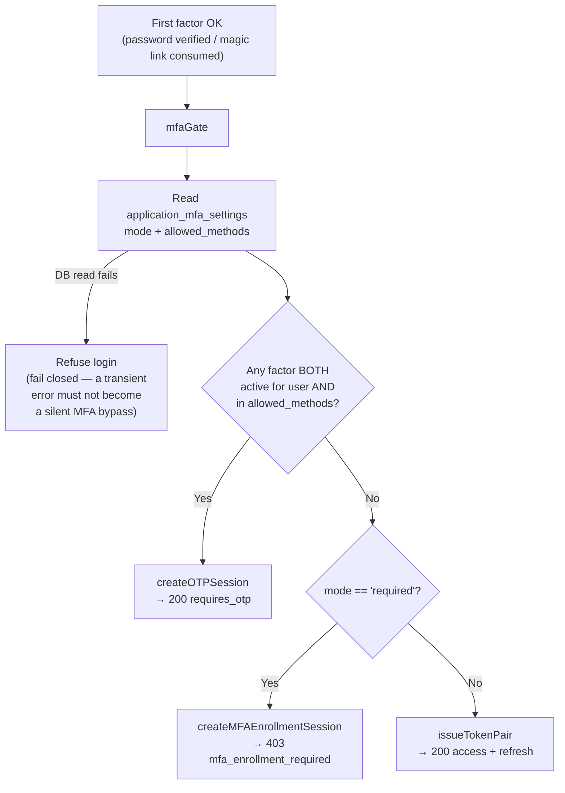
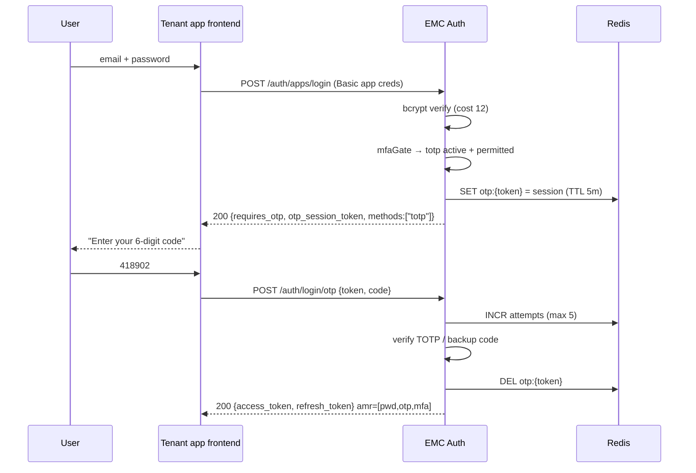
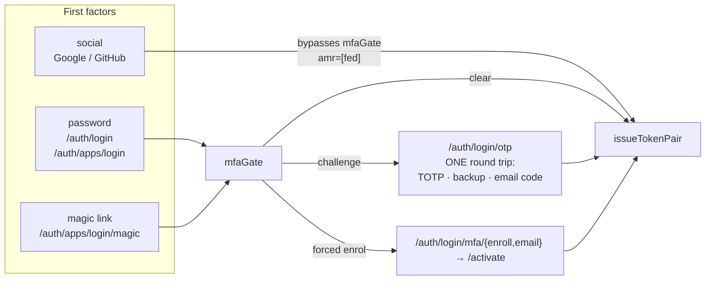
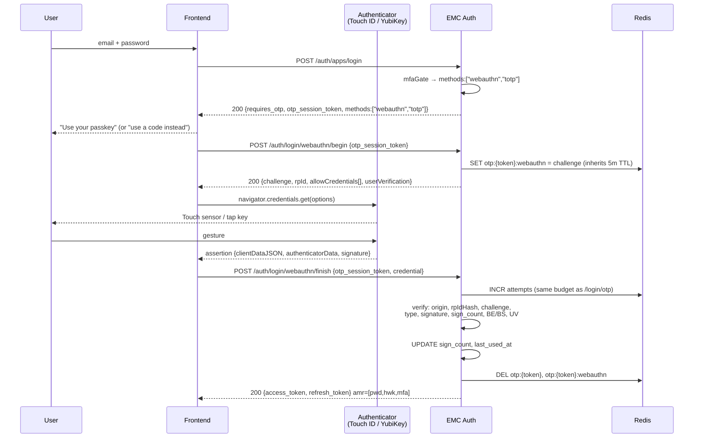
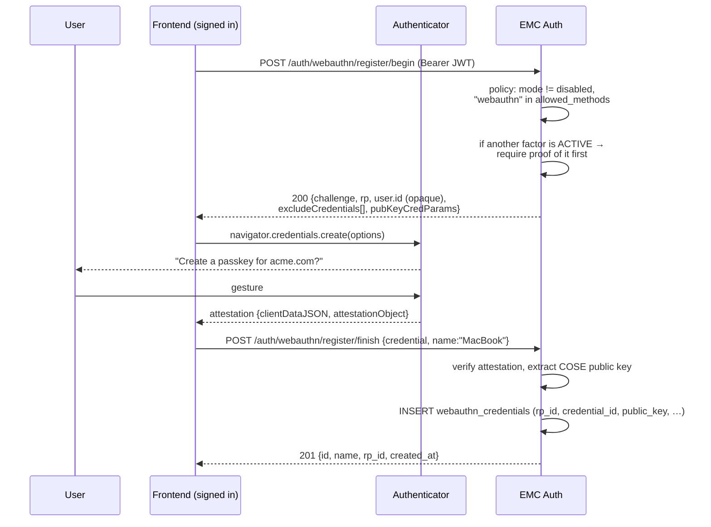
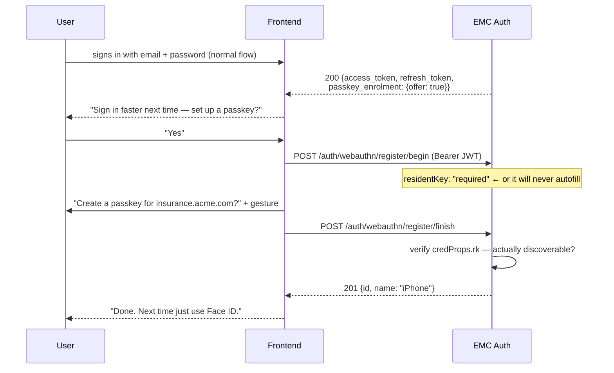
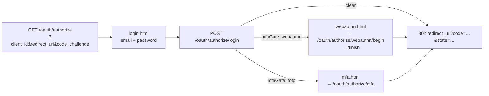

# Login flows today, and where WebAuthn slots in

Companion to `WEBAUTHN_PLAN.md`. This one is all mechanics: what the wire looks
like today, what changes, and in what order a user would notice it.

Every request/response below is the real shape from the current code
(`internal/auth/service.go`, `internal/api/handlers/auth.go`,
`internal/api/routes.go`) — not a sketch.

---

## Part 1 — How it works TODAY

### 1.1 The one junction that decides everything: `mfaGate`

Every first factor — password login, magic link — funnels through
`mfaGate` (`service.go:882`). It has exactly three outcomes:



Two properties worth holding onto, because WebAuthn must not break either:

- **The application policy is authoritative.** A factor is offered only when it
  is active for the user **and** still in the app's `allowed_methods`. Drop
  `totp` from the policy and already-enrolled users stop being challenged with
  it.
- **An active factor is never silently skipped** — not even when the app's mode
  is `disabled`. Removing a factor is an explicit admin action
  (`ResetUserMFA`), never a side effect of a config change.

### 1.2 Happy path — password + TOTP, today

`POST /api/v1/auth/apps/login`

```http
POST /api/v1/auth/apps/login
Authorization: Basic base64(client_id:client_secret)
Content-Type: application/json

{ "email": "priya@acme.com", "password": "…", "persistent": true }
```

The user has TOTP active → **200 OK**, no tokens:

```json
{
  "requires_otp": true,
  "otp_session_token": "9f3c…",
  "methods": ["totp"],
  "expires_in": 300
}
```

Server-side, `createOTPSession` has written one Redis key (5-min TTL) holding
`user_id, tenant_id, email, role, perms, app_id, methods[], persistent`. The
`persistent` flag rides along because the "remember me" tick happened on the
password form, one request ago, and the completion request has no way to know it.

`POST /api/v1/auth/login/otp`

```http
{ "otp_session_token": "9f3c…", "code": "418902" }
```

→ `bumpOTPAttempts` (budget 5, then the session dies) → try the emailed-code
hash, then TOTP, then a backup code → clear the session → **200** with tokens
and `amr: ["pwd","otp","mfa"]`.



### 1.3 Forced enrolment — app policy is `required`, user has nothing

Note the status code: **403**, not 200. There are no tokens and there is no JWT
yet; the `enrollment_token` authorises the `/auth/login/mfa/*` endpoints for
this one user and nothing else.

```json
{
  "mfa_enrollment_required": true,
  "enrollment_token": "a71b…",
  "allowed_methods": ["totp", "email"],
  "expires_in": 600
}
```

Then, per method:

| Method | Step 1 | Step 2 |
|---|---|---|
| TOTP | `POST /auth/login/mfa/enroll` → QR + backup codes | `POST /auth/login/mfa/activate` {token, first code} → **tokens** |
| Email | `POST /auth/login/mfa/email` → code sent to inbox | `POST /auth/login/mfa/activate` {token, code} → **tokens** |

The activation step completes the pending login — the user lands in the app
without retyping their password. TTL is 10 min here, not 5, because installing
an authenticator app takes longer than typing a code.

### 1.4 Self-service enrolment (user already signed in, has a JWT)

Group `/api/v1/auth/otp/*` (`routes.go:754`):

- `POST /auth/otp/enroll` → QR. Policy-checked. **If TOTP is already active,
  a valid current code is required** (`ErrTOTPReenrollProof`) — a stolen access
  token alone must not rotate someone's MFA secret.
- `POST /auth/otp/verify` → activate
- `GET  /auth/otp/status` → all-method state + backup codes remaining
- `POST /auth/otp/email/enroll` → `/email/activate` → `/email/send` → `DELETE /email`
- Removing your last factor while the app says `required` → refused
  (`ErrMFARequiredByPolicy`).

### 1.5 Today's full picture



---

## Part 2 — Where WebAuthn goes in

### 2.1 The single structural difference

TOTP is a **one-round-trip** factor: the user reads a code off their phone and
posts it. The server holds no per-attempt state beyond the session.

WebAuthn is **challenge–response**, so it is inherently **two** round trips:

```
begin   → server mints a random challenge, remembers it
        → browser calls navigator.credentials.get(), authenticator signs
finish  → server verifies the signature against the stored challenge
```

That is the *only* shape change to the login state machine. Everything else —
the Redis session, the 5-attempt budget, the `persistent` flag, the policy
check, the fail-closed read — is reused verbatim. The challenge lives on the
**existing** OTP session key (`otp:{token}:webauthn`), so it inherits the
attempt budget and the 5-minute window without a line of new expiry code.

### 2.2 Password + passkey as second factor (PR 3)



Note `methods: ["webauthn","totp"]` — the user keeps a fallback. That matters
in practice: a passkey on a laptop the user does not have with them today is
otherwise a lockout, and the alternative is a support ticket.

**The one subtlety.** `methods[]` becomes **RP-dependent** for the first time.
Whether `webauthn` is offerable depends on whether the user has a credential
for *this ceremony's RP ID* (see plan §2), so `mfaGate` needs the RP ID threaded
in. Get that wrong and the server offers a passkey on a surface where the user
has no usable credential — a dead end with no error to explain it.

### 2.3 Registration (PR 2) — same shape, JWT-authenticated



The **proof-of-existing-factor** step is the line most likely to be skipped.
Without it, an attacker holding a stolen access token adds their own passkey and
now has a durable, phishing-resistant credential on the victim's account. TOTP
already enforces exactly this (`ErrTOTPReenrollProof`); WebAuthn must match it.

### 2.4 ★ The target UX — passwordless with autofill (PR 4)

This is the one the owner asked for. `mfaGate` is not involved: this is a new
first factor that produces tokens on its own.

**What the user experiences:** they open the login page. They tap the email
field. Instead of the keyboard, the browser offers "priya@acme.com — passkey".
They tap it, Face ID confirms, they are in. **No password. No form submitted. No
login button.**

Two clarifications, because this differs from password-manager autofill in ways
that change what we build:

- There is **no form fill and no submit**. With a password manager, credentials
  drop into the fields and you press the button. With a passkey, the gesture
  *is* the sign-in — the fields stay empty and there is nothing to submit. The
  login button can be hidden entirely once the passkey resolves.
- The email field does not need to contain anything. The authenticator knows
  which accounts it holds for this site; that is what "discoverable" means.

#### The mechanism: `mediation: "conditional"`

The trick is that the `get()` call is made **on page load** and then *waits*. It
shows no modal. Its only effect is to tell the browser "this page accepts
passkeys" — which is what makes the browser decorate the email field.

```js
// Runs on page load, NOT on a button click. This is the whole trick.
if (await PublicKeyCredential.isConditionalMediationAvailable?.()) {
  const opts = await fetch('/api/v1/auth/webauthn/login/begin', {
    method: 'POST', body: JSON.stringify({ client_id })
  }).then(r => r.json());

  // Hangs here — no UI, no modal — until the user taps the suggestion
  // the browser has now put in the email field.
  const assertion = await navigator.credentials.get({
    mediation: 'conditional',
    publicKey: { ...decodeBinaryFields(opts) }   // allowCredentials is []
  });

  // Resolved = the user tapped and passed Face ID. They are authenticated.
  const res = await fetch('/api/v1/auth/webauthn/login/finish', {
    method: 'POST', body: encodeAssertion(assertion)
  });
  if (res.status === 401 && (await res.json()).code === 'challenge_expired') {
    return retry();          // tab sat open too long — silently re-arm
  }
  // → tokens. Navigate.
}
// Password form stays visible the whole time as the fallback.
```

```mermaid
sequenceDiagram
    participant U as User
    participant App as Login page
    participant B as Browser
    participant Auth as Authenticator
    participant API as EMC Auth

    Note over App: page load — user has done nothing
    App->>API: POST /auth/webauthn/login/begin {client_id}
    API-->>App: 200 {challenge, rpId, allowCredentials: []}
    App->>B: get({mediation:"conditional"}) — waits, shows nothing
    B->>B: decorate email field with passkey suggestions

    U->>B: taps the email field
    B-->>U: "priya@acme.com — passkey"
    U->>B: taps the suggestion
    B->>Auth: challenge
    Auth-->>U: Face ID / fingerprint
    U->>Auth: gesture
    Auth-->>B: assertion + userHandle
    B-->>App: get() promise resolves

    App->>API: POST /auth/webauthn/login/finish {credential}
    API->>API: userHandle → user; verify origin, rpIdHash,<br/>challenge, type, signature, sign_count, BE/BS, UV
    API-->>App: 200 {access_token, refresh_token} amr=[hwk,user,mfa]
    App-->>U: signed in
```

#### Three things this diagram is making a point of

1. **`begin` is hit on every page load, by every visitor, passkey or not.** That
   is a genuinely new traffic shape for us — see plan §6.3. It must be cheap (no
   DB read), IP-rate-limited (there is no account yet), and it writes a Redis key
   per page view.
2. **The abandoned-tab problem is the thing that will get reported as "passkeys
   are flaky".** The challenge lives 120 s; a login tab left open for an hour
   resolves against a dead challenge. `finish` must return a distinguishable
   `challenge_expired` so the frontend re-arms silently instead of showing the
   user a failure they did not cause. Handle it in PR 4, not in a bugfix later.
3. **`mfa` in `amr` is driven by the UV flag on the response**, never by the
   options we sent. One gesture on a device with biometrics genuinely is two
   factors (have + are). Without UV it is one, and the token must say so —
   otherwise passwordless is a downgrade from password+TOTP wearing an upgrade's
   clothes. With UV `required` (the default now), a missing flag is a hard
   rejection.

### 2.4b The other half: "create a passkey?" (PR 3)

The prompt in the owner's description — *"it sometimes asks for create a
passkey"* — is what populates the system. Without it, nobody has a credential and
§2.4 never fires for anyone.



`offer: true` requires the server to check the policy **and** that the user has
no credential for *this RP ID* — which is why it cannot be a pure frontend
decision. Plan §6.6.

### 2.5 Hosted login (PR 6)

Today the hosted login is two server-rendered pages driven by one hidden
`request` handle: password → TOTP. WebAuthn adds a third page in the same state
machine, resuming by the same handle:



This is the only surface where a **Pattern A** passkey (RP ID = our domain) can
be created, which is why the plan pairs it with the enrolment page that deferred
item #20 has been missing.

---

## Part 3 — What a user sees, PR by PR

| After PR | What exists | What a user can do |
|---|---|---|
| 1 — Foundation | table, service, config, test fixture | nothing user-visible |
| 2 — Registration | `/auth/webauthn/register/*`, credential CRUD, discoverability enforced | add a passkey from account settings — **but cannot yet log in with it** |
| 3 — Second factor + prompt | `mfaGate` branch, `/auth/login/webauthn/*`, `passkey_enrolment` hint | gets asked "create a passkey?" after login; password → passkey instead of a 6-digit code |
| **4 — ★ Passwordless + autofill** | `/auth/webauthn/login/*`, conditional mediation | **the target UX: tap the email field, Face ID, in** |
| 5 — Admin | policy fields, per-user credential list | tenant owner turns it on per application; support revokes a lost device |
| 6 — Hosted login | `webauthn.html` + authorize resume | same UX on the hosted OIDC login page |

PR 2 shipping before PR 3 looks odd — you can register a credential you cannot
use — but it is the right split: registration is where all the verification
plumbing gets exercised and reviewed, and a bug in PR 4 is a full authentication
bypass rather than the loss of one factor. Keep them one behind the other.

**PR 3 is what makes PR 4 non-empty.** Without the enrolment prompt nobody has a
credential, so the autofill in PR 4 has nothing to offer and the feature looks
dead on arrival. They are two PRs, but neither is shippable-to-users alone.

**Where each PR touches existing code:**

```
PR 2 ─ new files only  ────────────────► internal/auth/webauthn.go
                                          internal/api/handlers/webauthn.go
                                          routes.go (new group)

PR 3 ─ modifies the hot path ──────────► service.go       mfaGate: methods[] + RP ID
                                          session.go       AMRWebAuthn, AMRUserVerif
                                          mfa.go           ResetUserMFA, method const
                                          ratelimit.go     RateLimitHits wiring (#12)

PR 5 ─ new first factor ───────────────► service.go       new entry point, NOT via mfaGate
```

---

## Part 4 — Worked example: one user, over time

Priya, an end user of Acme's insurance app. Acme's application has
`mode = optional`, `allowed_methods = ['totp','email','webauthn']`.

**Day 1 — she already has TOTP.** Nothing changes. `mfaGate` offers
`["totp"]`, she types a code. Same as today.

**Day 2 — she is offered a passkey.** She signs in with her password as usual;
the response carries `passkey_enrolment: {offer: true}` and the app asks "sign in
faster next time?". Because TOTP is already active, `register/begin` demands a
current TOTP code first (§2.3). She provides it, touches her sensor, and a row
lands in `webauthn_credentials` with `rp_id = 'insurance.acme.com'`,
`name = 'MacBook Pro'`, discoverable.

**Day 3 — she opens the login page and never types anything.** On page load the
app armed a conditional `get()`. She taps the email field, the browser offers
"priya@acme.com — passkey", she taps it, Touch ID. Signed in, `amr:
["hwk","user","mfa"]`. No password, no code, no submit.

*This is the day the feature exists for.* Note what had to be true for it: the
credential was discoverable (day 2's `residentKey: "required"`), the challenge
was fetched before she touched anything, and UV was enforced so the token can
honestly claim `mfa`.

**Day 4 — she logs in from the hosted OIDC login page** at
`auth.emc.com/oauth/authorize`, because a different Acme app federates that way.
**Her passkey is not offered.** Its `rp_id` is `insurance.acme.com`; this
ceremony's RP ID is `auth.emc.com`; the browser would refuse it, so we do not
offer it. She falls back to TOTP, and can register a second passkey here if she
wants one.

*This is the moment that generates the support ticket.* It is WebAuthn working
exactly as designed — see plan §2 — and it is why both surfaces list credentials
with their RP ID, and why the tenant integration docs must say it out loud
before the first user hits it.

**Day 5 — she loses the MacBook.** Support revokes that credential
(`is_active = false`, audit row). Her TOTP still works. Had the passkey been her
only factor, she would be on the admin MFA reset path — the recovery story the
plan deliberately leaves out of scope, and the biggest real operational cost of
passkeys.
